# 🚗 Car Rental App – Android Studio Project

This is an Android application developed as a college project for a **Android Development Course**. Built in a team of three, the app simulates a complete **car rental system**, featuring both **customer-facing** and **admin interfaces**.

## 👩‍💻 My Role

As part of the team, I was fully responsible for the **entire front-end layout** of the application, both for **customers and admins**. I built all the **user interfaces** using XML in Android Studio, including layout design, structure, and screen transitions.

This project was completed in **just two weeks**. It was intense, especially as it was my **first real UI development experience**, but it turned out to be both challenging and incredibly enjoyable!

---

## 🚀 App Walkthrough (User Flow)

### 1. 📱 Splash Screen
The journey begins with a clean, animated **splash screen** that introduces the app.

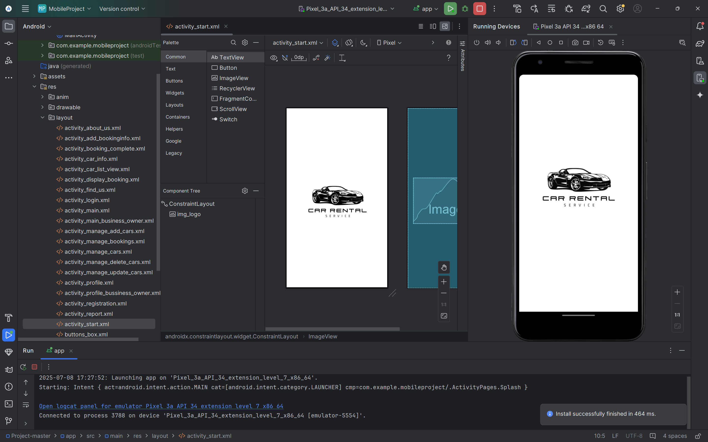

---

### 2. 🔐 Login Page
Users are prompted to **log in** as either a customer or an admin, and the also can register as new user.

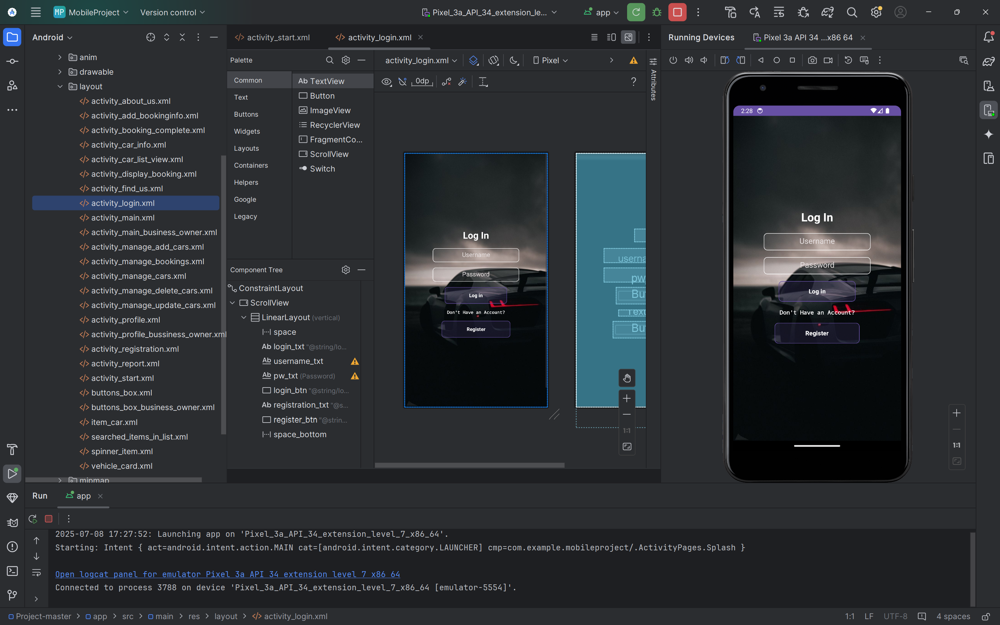

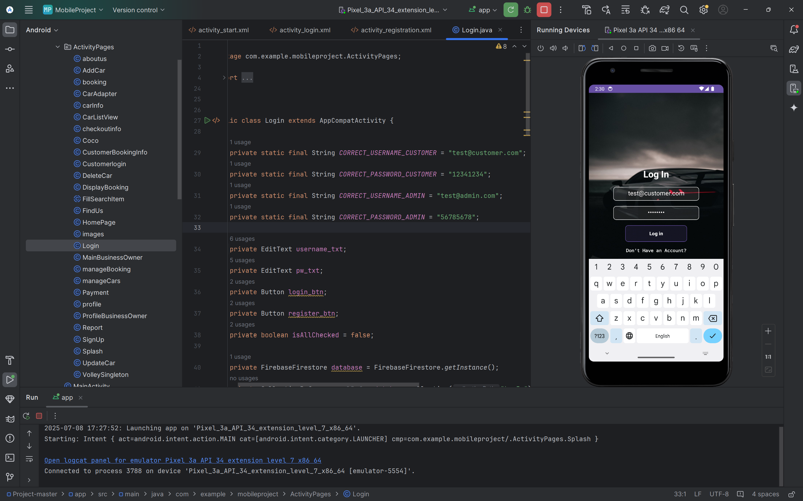

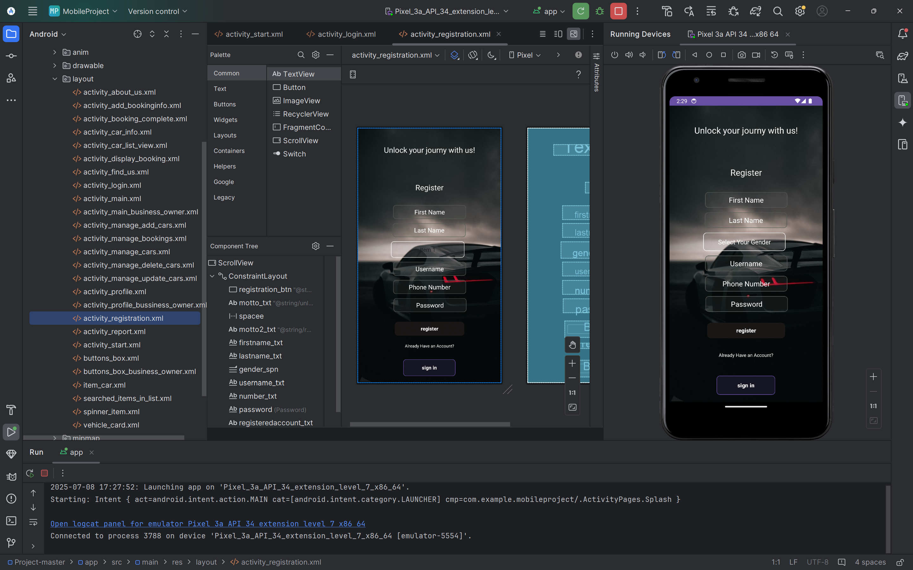

---

### 3. 🏠 Main Page (Customer)
Once logged in as a customer, users land on the **main dashboard**. From here, they can explore multiple features:
- **Search by brand** (by choosing the brand wanted from the scroll view on top)
- **Choose cars dislayed as cards** (by choosing the the cars inn the main scrolling of the page)
- **Find Us Page** (Includes a map or location info – we did the university's location & i actually handled the backend in this page)
- **Profile Page** (displays main information for user when registrations)
- **About Us Page** (accessed through the profile page)
- **Rent a Car Section** (by choosing a car and going to car info page)

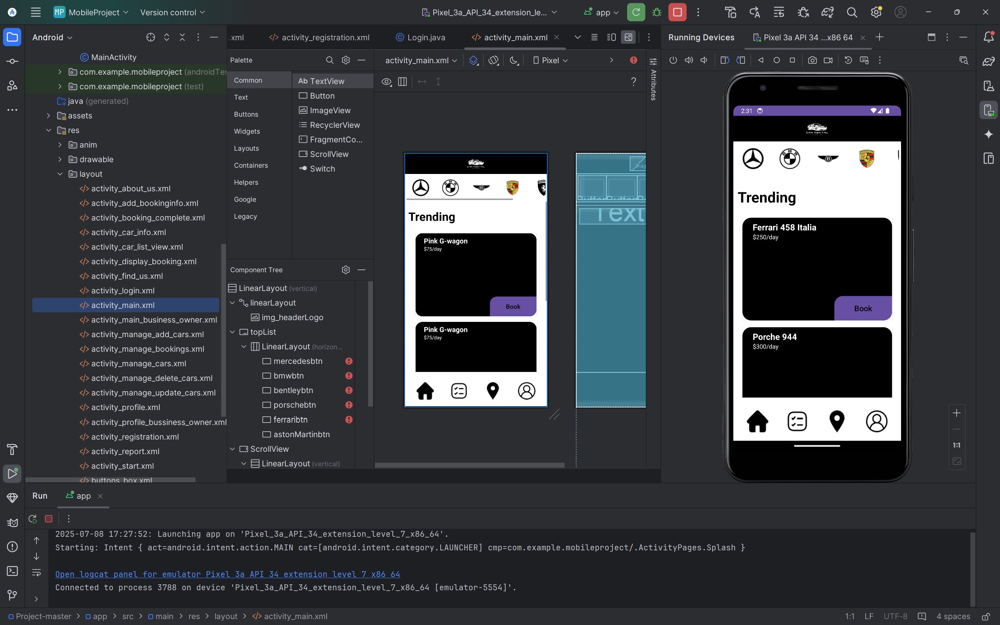

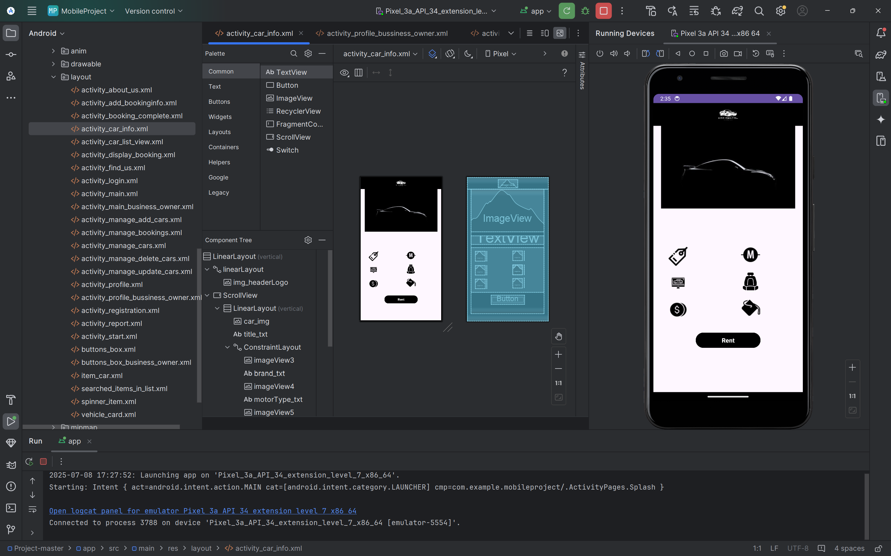

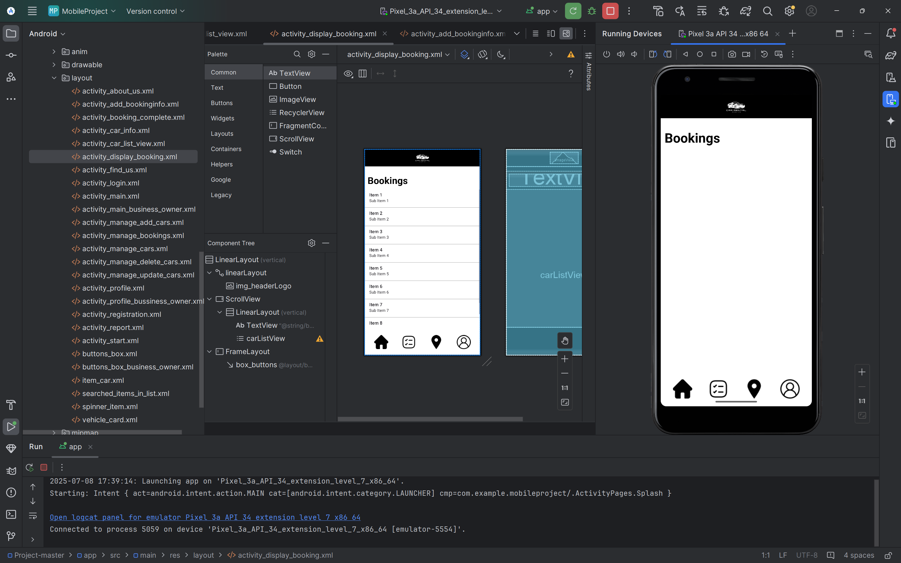

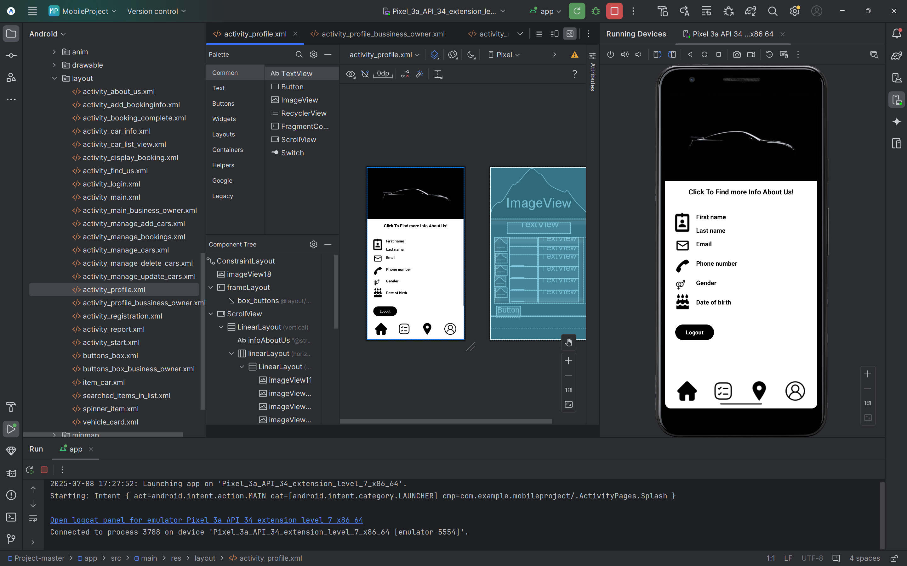

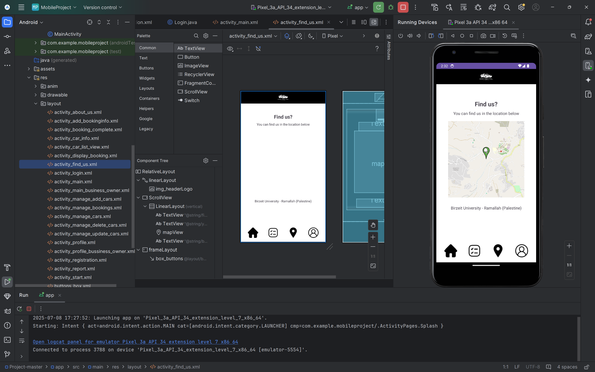

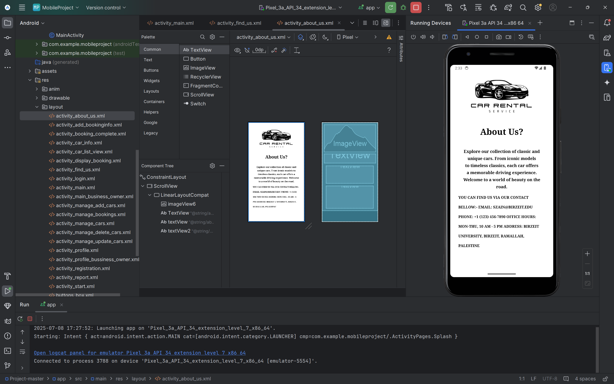

---

### 4. 🚘 Car Renting Flow
Customers can:
1. Browse available cars
2. Click to view **detailed car info**
3. Proceed to **rent** by entering booking details

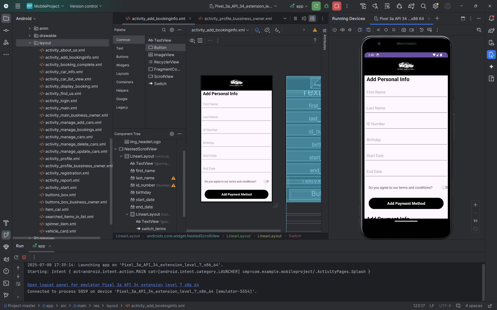

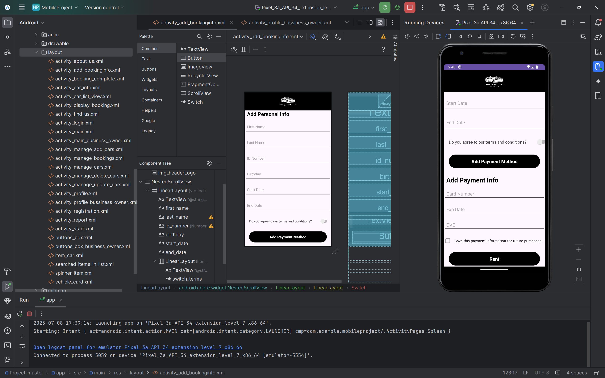

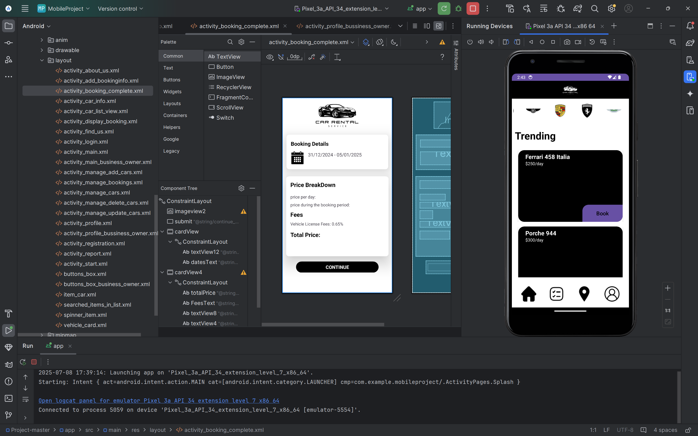

---

### 5. ⚙️ Admin Interface
Admins have their own dedicated UI to manage the system:
- **Manage Cars**: Add, edit, or remove cars
- **Manage Bookings**: View and update user bookings
- **Reports**: Select a car brand and a date range to view **car revenues and usage stats**

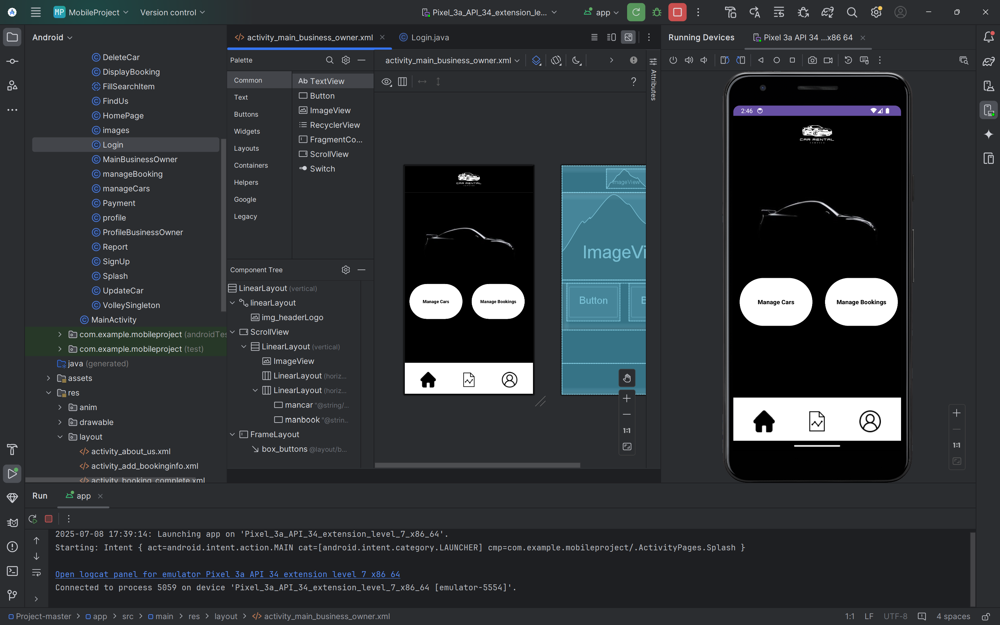

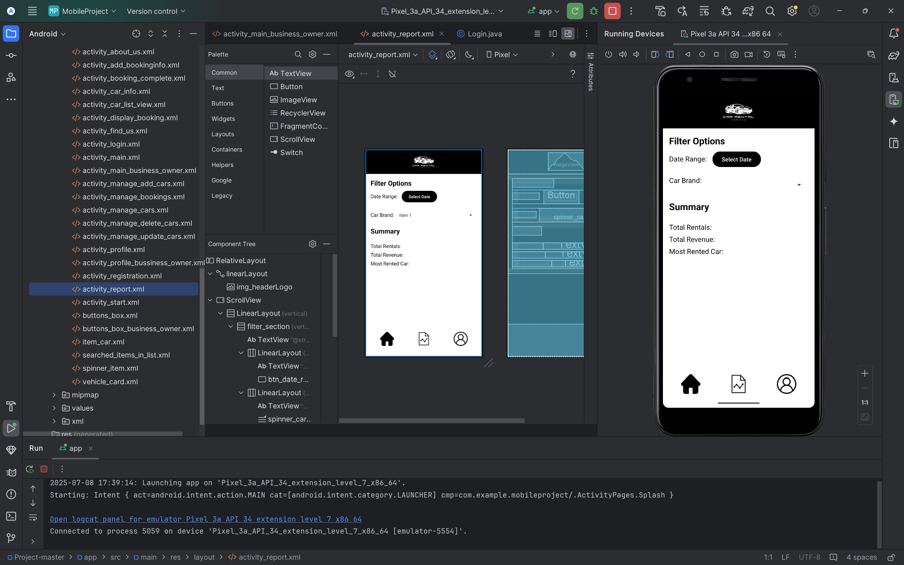

---

## 📣 Credits

Built by:
- [Hind Sumary] – Front-end Development (Customer/Admin UI)
- [Rama Shaheen] – [Back-end Development (Customer)]
- [Ayah Jumah] – [Back-end Development (Admin)]

---

## 🔚 Final Note

This app was a stepping stone in my journey into Android development. I’m proud of what we achieved as a team, and I’m even more proud of the user interface I created from scratch under pressure and with passion. ❤️

